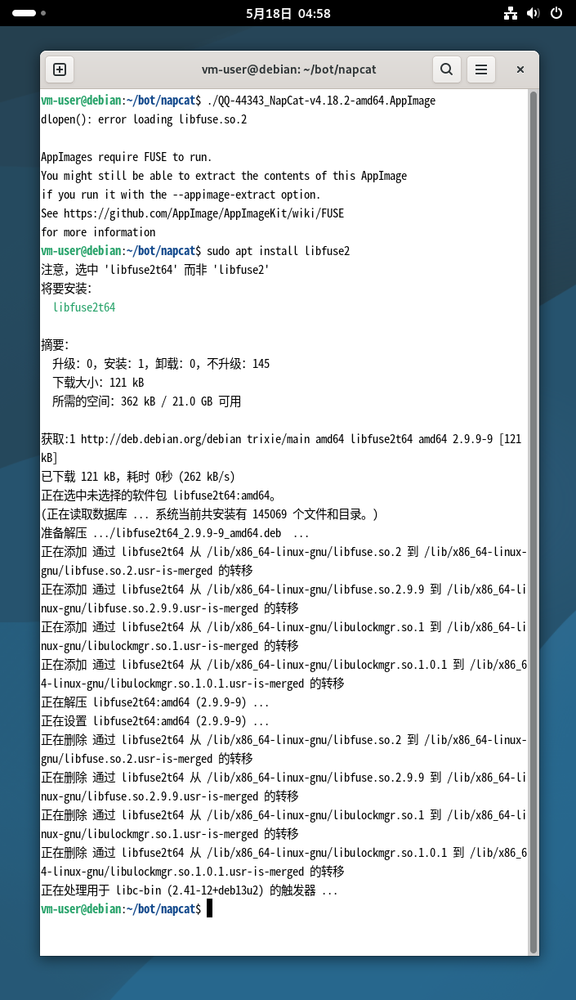
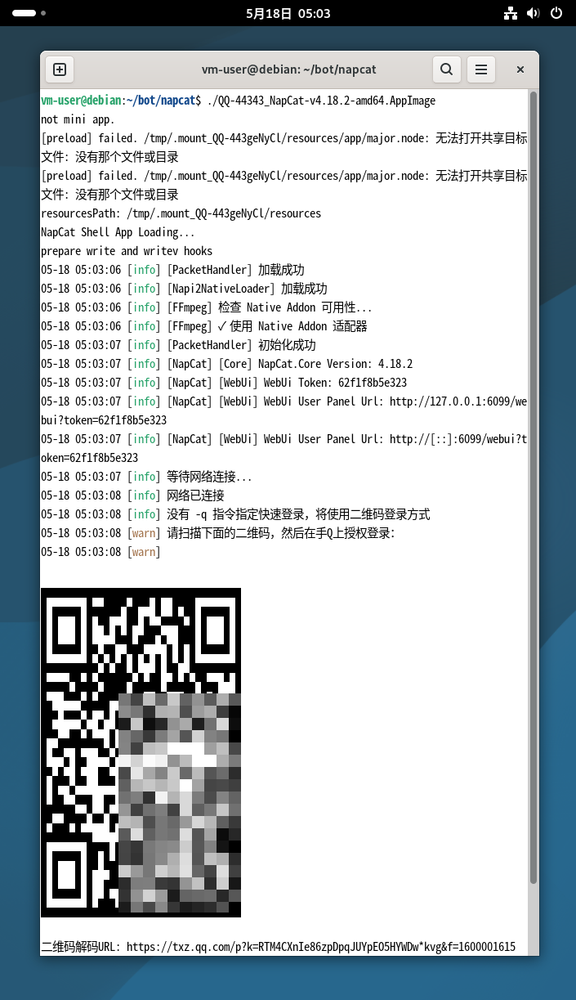
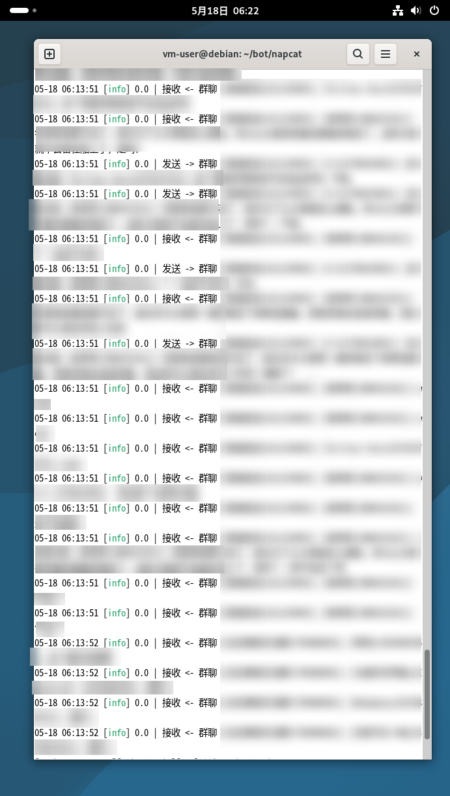

# 面向新手的使用鹊桥搭建 MC 服务器 QQ 互联指南

本文是一份面向新手的使用鹊桥搭建 MC <> QQ 互联指南，并以全新的、无图形界面的 Linux（Debian 13）进行演示。

本文主要使用的软件有 [Napcat](https://napneko.github.io)、[Nonebot](https://nonebot.dev) 和 [鹊桥](https://queqiao-docs.pages.dev)。

**Napcat** 是一款运行在命令行中的“QQ客户端”。它将消息接发等功能暴露给其他软件，开发者得以将自己的功能接入 QQ

**Nonebot** 是一款专门的机器人软件，负责机器人的逻辑处理，是实现机器人具体功能的软件。我们将 Napcat 接入 Nonebot，便让 Nonebot 有了操控 QQ 的能力

**鹊桥** 是一款安装在 Minecraft 服务器中的模组/插件。顾名思义，其作为是为 Minecraft 搭起一座与外部世界沟通的桥梁。我们将鹊桥接入 Nonebot，就可以让机器人将消息转发到 Minecraft，亦可将消息转发回 QQ

---

## 一、Napcat 的安装与配置

> Napcat 的官方下载页为：https://napneko.github.io/guide/install

Windows 端推荐选择 Napcat.Win.一键版本。官方教程[点这里](https://napneko.github.io/guide/boot/Shell#napcat-win-%E4%B8%80%E9%94%AE%E7%89%88%E6%9C%AC)  
Linux 端推荐选择 AppImage 版本。官方教程[点这里](https://napneko.github.io/guide/boot/Shell#napcat-appimage)  
Mac 和 Termux 端建议选择 Docker 版本。官方教程[点这里](https://napneko.github.io/guide/boot/Shell#napcat-docker-linux%E5%AE%B9%E5%99%A8%E5%8C%96%E9%83%A8%E7%BD%B2)

### 1. 安装 Napcat

本文演示用的系统是 Linux Debian，因此选择 AppImage 版本。使用上述链接


阅读完官方介绍后，发现下载链接在 [AppImage 仓库](https://github.com/NapNeko/NapCatAppImageBuild/releases)


除非特殊情况，否则直接选择 `.amd64.AppImage` 结尾的文件下载即可。通过下载页提示，我们需要先安装 `fuse` 和 `xvfb` 库作为前置。同时，为了方便从网络上直接将软件下载到服务器，我们再安装一个 `wget` 工具

让我先处理前置：

```shell
sudo apt update # 更新软件仓库，尤其是刚安装的系统，一定要进行一次 update
sudo apt install -y fuse xvfb wget 
```

你可以直接将这两行一起复制到终端并按下回车执行。可能会提示你输入密码，输入后按下回车继续执行即可


安装完前置后，我们来安装 Napcat。首先，我们先前往我们的`家目录`，在这里创建一个用来放置机器人相关软件、文件的目录，例如叫 `bot`。然后再在 `bot` 目录下建一个叫 `napcat` 的目录用来放 Napcat。

```shell
cd # 前往自己的家目录
mkdir bot # 在当前路径下创建名为 bot 的目录
cd bot # 前往当下路径下的 bot 目录
mkdir napcat
cd napcat
```

然后，我们进入创建好的 `napcat` 目录，将 Napcat 的 AppImage 文件下载下来，并给予运行权限。我们不直接在自己的电脑上下载 napcat 程序，而是复制其链接，并在服务器上直接下载


```shell
wget https://v6.gh-proxy.org/https://github.com/NapNeko/NapCatAppImageBuild/releases/download/v4.18.2/QQ-44343_NapCat-v4.18.2-amd64.AppImage
# 该处链接仅作演示。Napcat 更新频率高，请尽量用最新版的 Napcat，否则可能出现登录异常等问题。
# 本链接使用了 gh-proxy.com 的反代，以便在大陆机器上安装，只需要在原始的链接前加上 v6.ghproxy.org/ 即可。
# 详情请查阅 gh-proxy.com 官网。我们不为该服务负责
chmod +x QQ-44343_NapCat-v4.18.2-amd64.AppImage
# 该处文件名仅作演示。下载完成后，你只需要输入 QQ 的开头，再按 TAb，便会自动补全整个文件名
```


至此，Napcat 就成功安装好了。接下来我们需要将机器人账号登录上去

### 2. 启动 Napcat

通过上一步中的 `chmod +x` 命令，Napcat 的 AppImage 文件已经有了直接执行的权限。此时，只需要直接输入其 AppImage 文件的相对或绝对路径，即可启动 Napcat 了

```shell
./QQ-44343_NapCat-v4.18.2-amd64.AppImage 
# 本文件名只作演示，请根据情况更改
```

如果启动时显示 `error loading libfuse.so.2`，例如这样的文本：

```
vm-user@debian:~/bot/napcat$ ./QQ-44343_NapCat-v4.18.2-amd64.AppImage 
dlopen(): error loading libfuse.so.2

AppImages require FUSE to run. 
You might still be able to extract the contents of this AppImage 
if you run it with the --appimage-extract option. 
See https://github.com/AppImage/AppImageKit/wiki/FUSE 
for more information
```

这里显示缺失 `fuse` 库是因为，如果我们的 Linux 发行版较新，则在上一步中的安装时会安装的版本为 `fuse3`，而很多 AppImage，包括 Napcat 的 AppImage 文件需要的是 `fuse3`。我们需要显式的选择 `fuse2` 进行安装

```shell
sudo apt install libfuse2
```



正常启动后，终端中将会显示登录二维码、WebUI 链接等信息。



### 3. 登录机器人账号

通过上一步，我们成功启动了 Napcat，终端中显示了登录二维码和 WebUI 链接。前者用于登录，后者用于配置 Napcat

我们先将控制台中显示的 WebUI 链接复制下来，你可以把这个链接通过 QQ 发给自己。注意，这个链接的后半段参数为 WebUI 的密码，所以一定不要泄露了。链接应该类似这样：

```
http://127.0.0.1:6099/webui?token=62f1f8b5e323
```

接下来，我们使用手机登录机器人 QQ 号，并扫码登录

当在终端能看到所有机器人同步到的私聊和群聊消息时，就说明登录成功了

我们还需要更多信息才能继续配置 Napcat。下一章，我们将进行 Nonebot 的配置



## 二、Nonebot 的安装与配置

> Nonebot 的官方配置教程页在这里：[快速上手](https://nonebot.dev/docs/quick-start)

与 Napcat 不同，Nonebot 不是一个独立运行的程序，而是一个 Python 包。这是为了利用 Python 上丰富的生态来为机器人创建多种多样的功能。

### 1. 准备 Python 环境

Nonebot 需要 Python 3.9 以上的版本。我们还需要安装 `pip`, `venv` 和 `python-is-python3`

```shell
sudo apt update # 更新是为了确保等下安装的包是最新的
sudo apt install python3 python3-pip python3-venv python-is-python3
```

安装好后，我们需要使用 pip 来安装 pipx

```shell
python -m pip install --user pipx
python -m pipx ensurepath
```

其中：

- `python3` 是 Python 本体，因为 Python2 和 3 的差异很大，所以所有 Python3 的包都会带 `python3` 的字样。很多系统都会自带 Python3，但以免万一，我们这里还是安装一下（如果已经安装，则不会重复安装）
- `python3-pip` 是 pip，用于安装第三方包，也可以称作库，是一些社区制作的用于实现特定功能的程序。Nonebot 就是一个第三方包
- `python3-venv` 是 venv，也就是我们常说的虚拟环境，用于隔离第三方包。使用虚拟环境是为了避免版本冲突、保持系统整洁和避免影响系统本体。只言片语很难说明白为什么要使用虚拟环境，只需要记得，当需要安装 Python 包时，一定要在虚拟环境下进行
- `python-is-python3` 是一个便利性包，功能很简单，就是添加了一个`软链接`，让你在终端输入 `python` 时，自动指向 `python3`，就不需要每次输入命令时都要加个 3 了
- `pipx` 是 pipx，与用于安装包/库的 pip 不同，pipx 更侧重于安装成品应用。pip 和 pipx 都是从同一个来源下载包，但 pipx 会自动为安装好后的包创建一个独立的虚拟环境，并且随处可用。一般来说，我们使用 pipx 当应用直接装到系统全局环境里，而将使用 pip 安装的包安装到虚拟环境里

